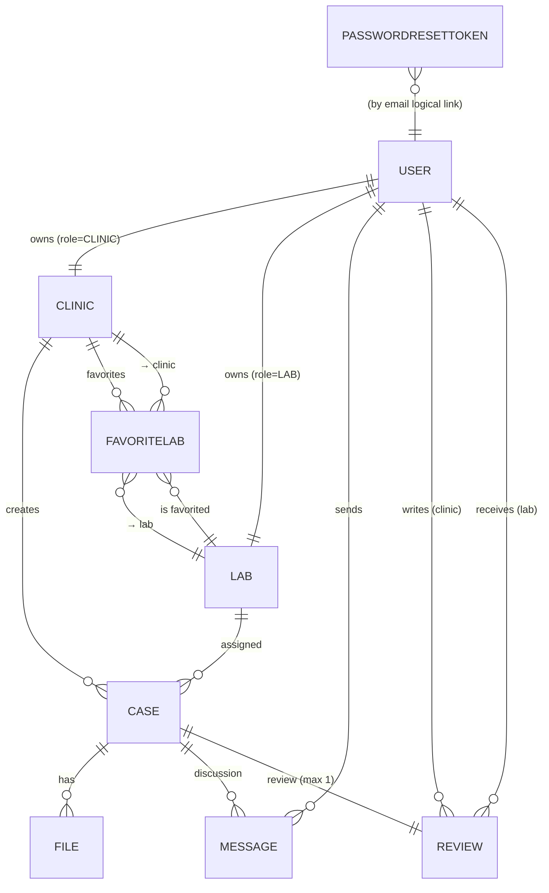

# Entity Relationship (ER) Model – i-Dentity

Beginner-friendly visualization of how the data tables relate. Built from `prisma/schema.prisma`.

## 1. Mermaid ER Diagram
(Render this in a Mermaid-enabled viewer, e.g. VS Code with Mermaid extension or an online renderer.)

## 2. Entities & Key Fields (Simplified)
| Entity | PK | Key Fields (non-exhaustive) | Notes |
|--------|----|-----------------------------|-------|
| User | id | name, email (unique), role | Role = CLINIC or LAB; 1:1 with Clinic or Lab profile |
| Clinic | id | name, specialties[], userId (unique) | Geolocation (lat/long) stored here |
| Lab | id | name, specialties[], services[], userId (unique) | rating, turnaroundTime |
| Case | id | title, status, clinicId, labId? | statusHistory JSON; links to Files, Messages, Review |
| File | id | filename, originalName, fileUrl, caseId | Cloudinary URL + metadata |
| Message | id | caseId, senderId, content | Conversation per case |
| Review | id | caseId (unique), clinicId, labId, rating | Exactly one review per case (if submitted) |
| FavoriteLab | id | clinicId + labId (unique pair) | Join (many-to-many) clinic ↔ lab favorites |
| PasswordResetToken | id | email (unique), token, expiresAt | No FK (email match); security token |

## 3. Relationship Summary
| Relationship | Type | Cardinality | Explanation |
|--------------|------|-------------|-------------|
| User ↔ Clinic | 1:1 (optional) | One clinic profile per clinic user | Only users with role CLINIC have this row |
| User ↔ Lab | 1:1 (optional) | One lab profile per lab user | Only users with role LAB have this row |
| Clinic ↔ Case | 1:N | A clinic creates many cases | `Case.clinicId` FK |
| Lab ↔ Case | 1:N (optional) | A lab may handle many cases | `Case.labId` nullable until accepted |
| Case ↔ File | 1:N | Case can have many uploaded STL / design files | Cascade delete on case removal |
| Case ↔ Message | 1:N | Thread of messages per case | Supports collaboration |
| Case ↔ Review | 1:1 (optional) | At most one review per completed case | `caseId` unique in Review |
| User (clinic) ↔ Review | 1:N | Clinic users write many reviews | `clinicId` references User.id (role CLINIC) |
| User (lab) ↔ Review | 1:N | Lab users receive many reviews | `labId` references User.id (role LAB) |
| Clinic ↔ Lab (favorites) | M:N via FavoriteLab | A clinic can favorite many labs; a lab can be favorited by many clinics | Unique pair prevents duplicates |
| User ↔ Message | 1:N | A user sends many messages | `senderId` FK |
| PasswordResetToken ↔ User | Logical 1:1 via email | Not enforced; matched on email during reset |

## 4. Lifecycle Touchpoints
- Case status moves (NEW → ACCEPTED → DESIGNING → READY → DISPATCHED → DELIVERED) tracked in `Case.status` + appended objects inside `statusHistory` (JSON array).
- Review becomes available after case reaches DELIVERED (business rule enforced in API layer, not schema).
- FavoriteLab acts purely as a join table; query patterns often filter by `clinicId` for a clinic's saved labs.

## 5. Normalization & Rationale
- Profiles split (Clinic, Lab) to avoid nullable columns on User (role-specific fields isolated).
- `statusHistory` kept as JSON for fast iteration (denormalized). Future: separate `CaseStatusEvent` table for analytics.
- `FavoriteLab` dedicated join keeps future metadata room (e.g., tagged reason, priority) while maintaining uniqueness.
- `PasswordResetToken` uses email instead of FK to simplify flow even if a user hasn't confirmed account (trade-off: no referential integrity).

## 6. Potential Enhancements
| Area | Improvement |
|------|-------------|
| Case Status History | Normalize to table (CaseStatusEvent) with index on (caseId, timestamp) |
| Reviews | Precompute & store lab aggregate rating (materialized view or trigger) |
| Geospatial | Add PostGIS extension; store geography(Point) for proximity queries |
| Security | Add User.tokenVersion for JWT invalidation, hash reset tokens |
| Messaging | Add read receipts / attachments table |

## 7. Quick Mental Model (Plain Language)
A User signs up either as a Clinic or Lab. A Clinic creates Cases; Labs accept them. Each Case collects Files (3D models), Messages (chat), and ultimately one Review. Clinics can bookmark (favorite) Labs. Password resets are handled with a temporary token row keyed by email.

## 8. Cheat Sheet (Cardinality Notation)
- 1:1 → Exactly zero or one related row (depending on optionality).
- 1:N → Parent has many children; child holds foreign key.
- M:N → Two entities relate through a join table with foreign keys to each.

---
*Use this file in interviews to narrate: start with User ↔ Role Profiles, move through Case core, then auxiliary concerns (Files, Messages, Review, Favorites, Security).*
